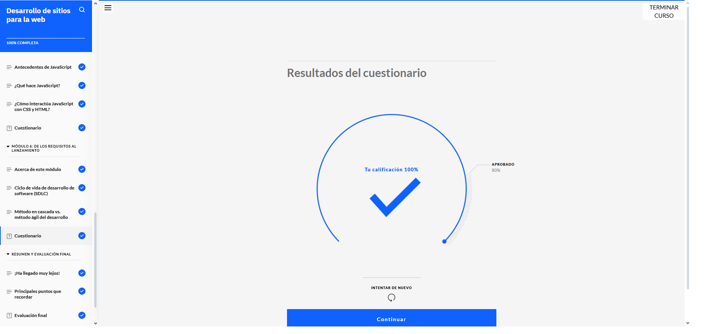
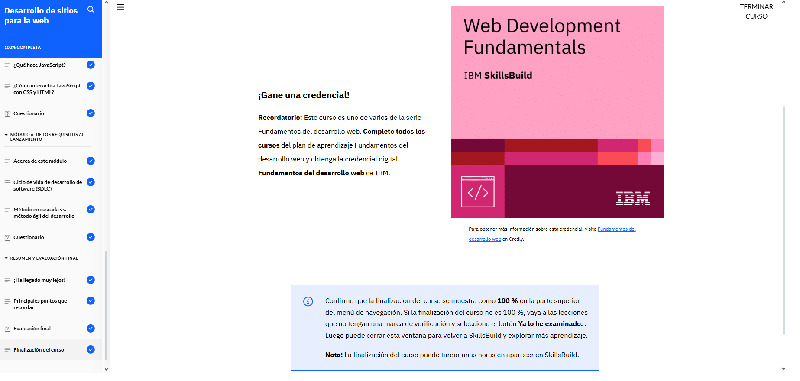

# Desarrollo de sitios para la web

Después de terminar este curso, entendí para qué sirven los exploradores web y cómo nos ayudan a navegar por los sitios en Internet. Aprendí qué son los lenguajes de marcado y cómo nos permiten organizar la información en la web de una forma más clara y útil.

También vi cómo está estructurado el código HTML, para qué sirve y cómo ha evolucionado con el tiempo. HTML5 trajo mejoras muy útiles, como nuevas etiquetas y funciones que hacen que las páginas sean más completas. Además, conocí lo que hace CSS para darle estilo a las páginas y cómo JavaScript permite agregar interactividad y hacer que todo sea más dinámico.

Descubrí cómo JavaScript se conecta con HTML y CSS para que todo funcione bien junto. Por otro lado, entendí cómo funciona el ciclo de vida del desarrollo de software y las diferencias entre hacerlo paso a paso (en cascada) o de forma más flexible (ágil). Dentro de lo ágil, me pareció muy interesante el marco Scrum, que ayuda a trabajar mejor en equipo y organizar las tareas.  

