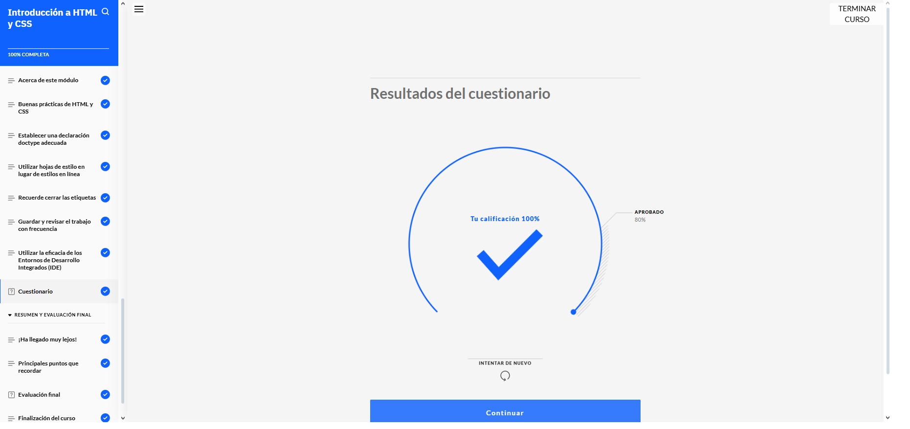
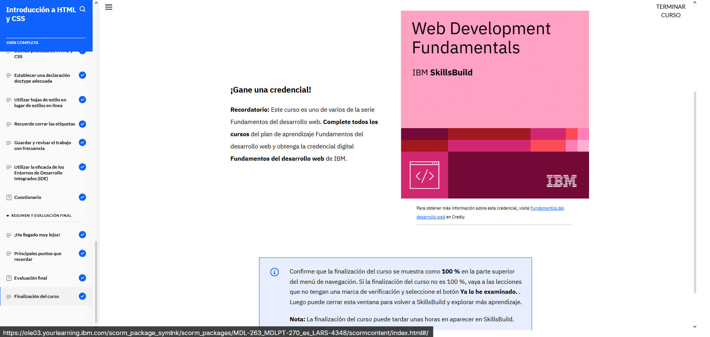

# Introducción a HTML y CSS

Durante el curso, aprendí cómo los desarrolladores web usan los elementos HTML para construir la estructura básica de una página web. Conocí los elementos más comunes, como encabezados, párrafos, listas, enlaces e imágenes, y entendí qué papel juega cada uno dentro del contenido.

También vi qué son los atributos en HTML, cómo se usan y cuáles son los más comunes, como href, src, class y id. Entendí que estos atributos ayudan a personalizar el comportamiento y la apariencia de los elementos.

Además, aprendí técnicas para mantener el código ordenado, algo que no solo nos facilita la vida a los desarrolladores, sino que también mejora la experiencia de los usuarios. Con CSS, descubrí distintas formas de aplicarlo al HTML, ya sea directamente en línea, en la cabecera o en archivos externos.

Me familiaricé con el modelo de caja de CSS, entendiendo cómo funcionan los márgenes, bordes, rellenos y contenido. También aprendí buenas prácticas para escribir HTML y CSS de forma limpia, clara y eficiente.

Por último, conocí lo que es un entorno de desarrollo integrado (IDE) y cómo sus herramientas —como el resaltado de sintaxis, la autocompletación o la vista previa— pueden mejorar mucho el flujo de trabajo cuando estás creando sitios web.  

