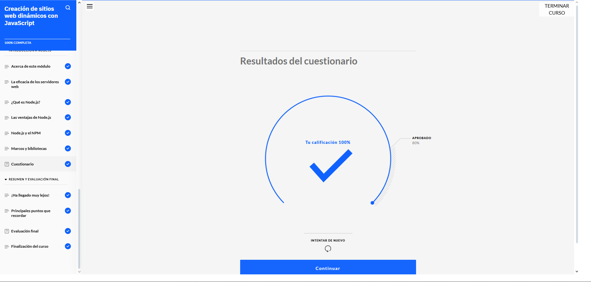
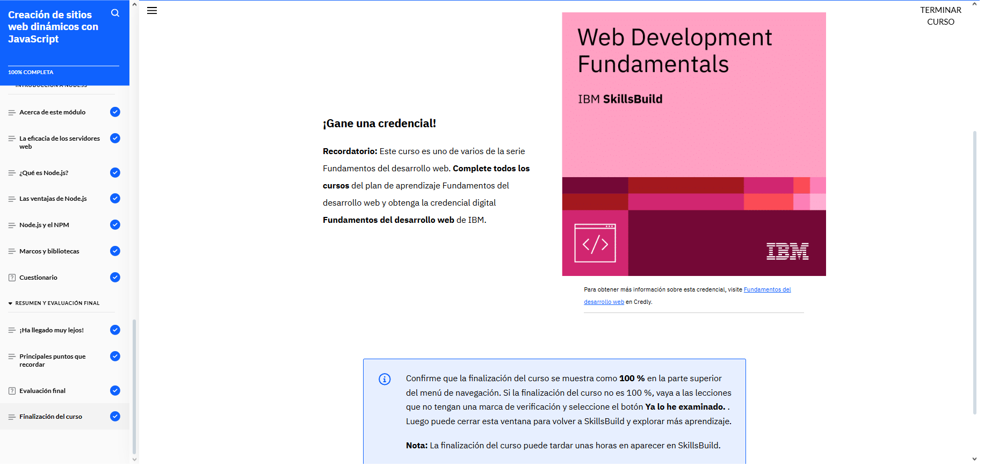

# Creación de sitios web dinámicos con JavaScript  
En esta parte del curso, me metí más de lleno en la lógica detrás de los sitios web dinámicos. Aprendí la sintaxis básica de JavaScript y cómo se puede incluir en una página HTML de diferentes maneras: dentro de la misma página, en la cabecera, al final del body o desde archivos externos. También vimos distintos modelos de programación y cómo se diferencian entre sí.

Entendí cómo se usan los objetos en el código y cómo funcionan las variables, las funciones, las expresiones, los operadores y los eventos para darle vida a una web. Conocí los tipos de datos más comunes, como números, cadenas de texto, booleanos, arreglos y objetos, que son clave para manejar la información.

También aprendí sobre bases de datos: las cuatro funciones principales (crear, leer, actualizar y eliminar datos), y cómo usar comandos simples de MySQL para crear una base de datos y manipular datos. Finalmente, descubrí para qué sirve Node.js y cómo permite usar JavaScript del lado del servidor, lo que abre muchas posibilidades en el desarrollo web moderno.

