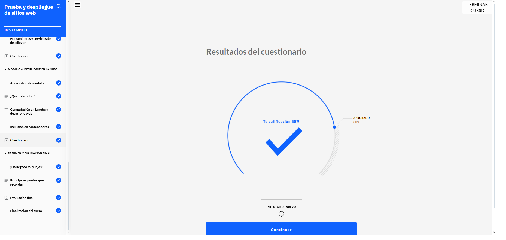
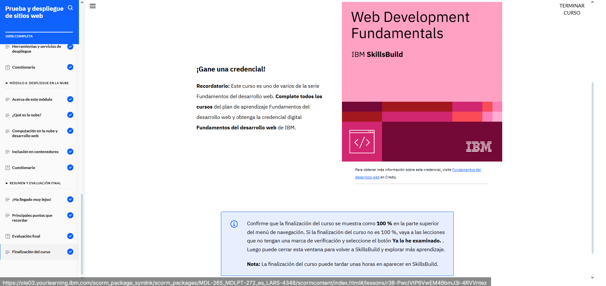

# Prueba y despliegue de sitios web  
En este curso, aprendí que probar un sitio web es clave para asegurarse de que todo funcione bien. Vimos distintos tipos de pruebas, como las de funcionalidad, compatibilidad, rendimiento y seguridad, y entendí lo útiles que son las pruebas automatizadas para ahorrar tiempo y evitar errores repetitivos. También descubrí cómo los sistemas de control de versiones, como Git, ayudan a mantener el orden cuando varios desarrolladores trabajan en el mismo proyecto.

Aprendí los pasos para publicar un sitio web y conocí la diferencia entre entrega continua (donde se preparan actualizaciones constantes) y despliegue continuo (donde esas actualizaciones se publican automáticamente). Me quedó claro qué es DevOps, cómo une desarrollo y operaciones, y por qué es tan útil para automatizar procesos y trabajar mejor en equipo.

También exploramos el diseño reactivo (responsive), que hace que los sitios se adapten a diferentes dispositivos, algo súper importante hoy en día. Vi cómo se entrega el contenido web tanto en sitios como en aplicaciones, y entendí la diferencia entre contenedores y máquinas virtuales. Aprendí a usar herramientas para probar y automatizar el despliegue, y conocí cómo la computación en la nube y los contenedores (como Docker) hacen que todo el proceso de desarrollo y despliegue sea más ágil, flexible y escalable.

