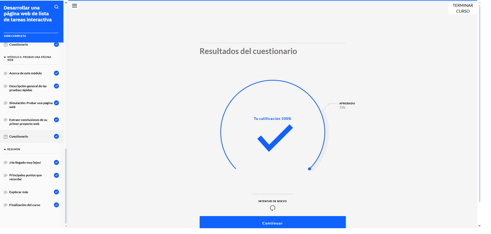
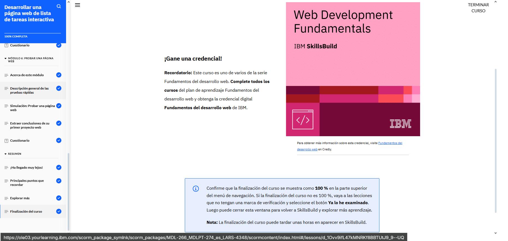

# Desarrollar una página web de lista de tareas interactiva  

Durante esta parte del curso, entendí qué herramientas y conocimientos se necesitan para desarrollar una página web desde cero. Aprendí a revisar los requisitos del proyecto y a usar un diagrama de wireframes para tener una idea clara de cómo debería verse y funcionar el sitio antes de empezar a codificar.

Usamos Visual Studio Code como entorno de desarrollo, y con él pude organizar los archivos del proyecto y comenzar a crear mi propia página. Empecé construyendo una estructura HTML básica para definir el contenido, luego apliqué estilos con CSS para que se viera bien, y finalmente añadí interactividad con JavaScript para hacerla más dinámica.

También realicé una prueba funcional simple para asegurarme de que todo lo que había construido estuviera funcionando como se esperaba. Fue una buena manera de ver cómo se conectan todas las piezas en un proyecto web real.
 
 
 