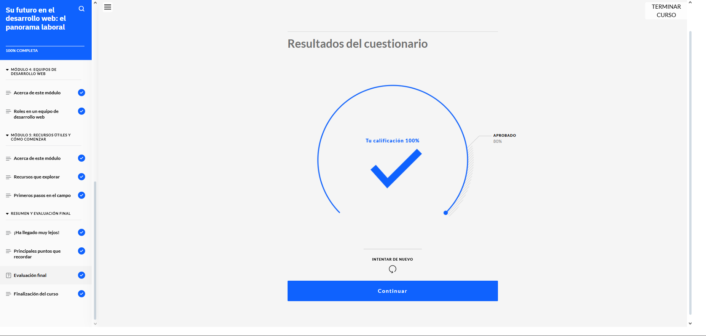
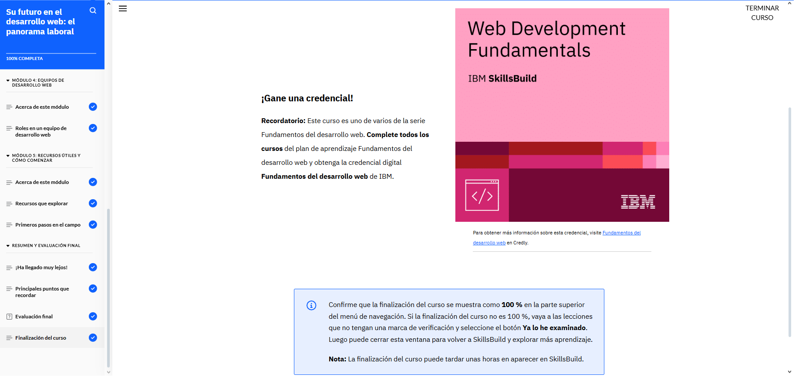

# Su futuro en el desarrollo web: el panorama laboral

En la parte final del curso, aprendí sobre el mundo laboral del desarrollo web. Descubrí que los desarrolladores web pueden trabajar en muchos sectores: desde tecnología y comercio electrónico hasta educación, salud o entretenimiento. También me di cuenta de que hay una gran demanda global de profesionales en este campo, y que todo apunta a que seguirá creciendo en el futuro con nuevas tecnologías y necesidades digitales.

Conocí los roles más comunes, como desarrollador front-end, back-end, full-stack, diseñador web, entre otros, y entendí cuáles son sus responsabilidades dentro de un equipo. Aprendí que cada uno tiene tareas específicas, pero que todos necesitan competencias clave como lógica, creatividad, trabajo en equipo y estar siempre dispuestos a seguir aprendiendo.

También vi que hay muchos recursos para mantenerse actualizado, como cursos online, comunidades de desarrolladores, documentación oficial y tutoriales. Esto me ayudó a entender que ser desarrollador web no es solo un trabajo, sino un camino de aprendizaje constante.}

