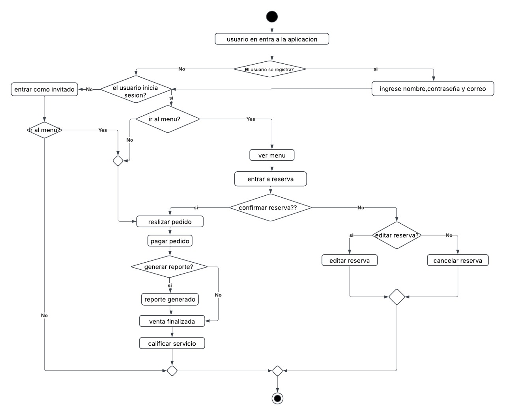
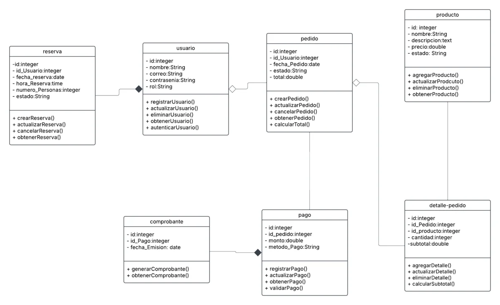

# Documentación HU - 01 : Introducción de gestión de CaffeNet

## Diagrama de caso de uso

### Descripción  
El siguiente diagrama representa los casos de uso del sistema de una cafetería, donde interactúan tres tipos de actores: **Cliente, Empleado y Administrador**. Cada actor tiene 
acceso a diferentes funcionalidades dentro del sistema.  

### Actores  
- **Cliente**: Puede registrarse, iniciar sesión, ver el menú, realizar reservas, hacer pedidos, pagar y calificar el servicio.  
- **Empleado**: Se encarga de gestionar el inventario y generar reportes.  
- **Administrador**: Tiene permisos para gestionar usuarios, generar reportes y gestionar el inventario.  

### Casos de Uso  

#### Cliente  
- **Registrarse**: Permite a un cliente crear una cuenta en el sistema.  
- **Login**: Permite autenticarse en el sistema.  
- **Ver menú**: Consulta el menú de productos disponibles en la cafetería.  
- **Reserva**: Incluye la funcionalidad de:  
  - **Confirmar reserva**  
  - **Editar reserva** (Extiende la reserva)  
  - **Cancelar reserva** (Extiende la reserva)  
- **Pedido**: Incluye la funcionalidad de:  
  - **Realizar pago**  
  - **Calificar servicio** (Extiende el pedido)  

#### Empleado  
- **Gestionar inventario**: Permite la administración de los productos en stock.  

#### Administrador  
- **Gestión de usuarios**: Administra los usuarios del sistema.  
- **Generación de reportes**: Se encarga de generar informes sobre la actividad de la cafetería.  
- **Gestionar inventario**: Permite modificar la cantidad y disponibilidad de productos.  

### Relación entre casos de uso  
- **Incluye (`<<include>>`)**:  
  - La reserva incluye la confirmación, edición y cancelación de reserva.  
  - El pedido incluye la realización de pago.  

- **Extiende (`<<extends>>`)**:  
  - Editar y cancelar reserva extienden el caso de uso "Reserva".  
  - Calificar servicio extiende el caso de uso "Pedido".  
  - La generación de reportes extiende la funcionalidad de gestionar inventario.

# Imagen

## Diagrama de procesos

### 1. Descripción General**  
Este diagrama de proceso representa el flujo de interacción de un usuario dentro de una aplicación, desde su ingreso hasta la finalización de un pedido o reserva. Se incluyen 
decisiones clave como el registro e inicio de sesión, la gestión de reservas y pedidos, la confirmación de transacciones y la generación de reportes. El proceso busca optimizar la 
experiencia del usuario al permitir diferentes caminos según su tipo de acceso.

### 2. Etapas del Proceso 

#### 2.1 Ingreso a la Aplicación  
El usuario accede a la aplicación y se le presentan dos opciones:  
- **Registrarse**, ingresando su nombre, correo y contraseña.  
- **Iniciar sesión**, si ya tiene una cuenta.  
- También puede optar por **entrar como invitado** sin necesidad de registro.

#### 2.2 Navegación en el Menú 
Una vez dentro, el usuario puede:  
- **Ir al menú** para visualizar las opciones disponibles.  
- **Entrar a la sección de reservas** para gestionar su reserva.

#### 2.3 Gestión de Reservas  
Si el usuario entra a la sección de reservas, puede:  
- **Confirmar la reserva** y proceder con la siguiente fase.  
- **Editar la reserva**, en caso de que necesite modificarla.  
- **Cancelar la reserva**, si ya no la necesita.

#### 2.4 Proceso de Pedido  
Si el usuario decide realizar un pedido, debe seguir estos pasos:  
1. **Realizar el pedido**, seleccionando los productos o servicios deseados.  
2. **Pagar el pedido**, confirmando el método de pago.  
3. **Generar un reporte**, si así lo requiere.  

Si se genera el reporte, se registra la transacción y el sistema finaliza la venta. Luego, se da la opción de **calificar el servicio** antes de cerrar el proceso.

### 3. Decisiones Clave en el Proceso  
El diagrama incorpora varias decisiones que afectan el flujo del usuario, como:  
- **¿El usuario se registra?** Determina si el usuario debe ingresar sus credenciales o continuar como invitado.  
- **¿Inicia sesión?** Si no lo hace, solo puede acceder como invitado.  
- **¿Ir al menú?** Permite al usuario elegir entre explorar el menú o entrar a la sección de reservas.  
- **¿Confirmar la reserva?** Define si el usuario avanza en el proceso de reservas o si necesita modificarla.  
- **¿Generar reporte?** Indica si se almacena un reporte de la transacción antes de finalizar la venta.  

### 4. Consideraciones Finales  
Este flujo de proceso está diseñado para ofrecer una experiencia flexible a los usuarios, permitiéndoles navegar y completar tareas de manera eficiente. El sistema soporta tanto
usuarios registrados como invitados, asegurando que los pedidos y reservas sean manejados de forma estructurada.  

### Imagen

## Diagrama de Clases

### 1. Descripción General 
El siguiente diagrama de clases representa la estructura del sistema de gestión de reservas, pedidos y pagos. Define las clases principales, sus atributos y los métodos asociados a
cada una. Este modelo permite la gestión de usuarios, productos, pedidos y transacciones dentro del sistema.

### 2. Clases y Relaciones  

#### 2.1 Clase `usuario`
Representa a los usuarios del sistema, que pueden realizar reservas y pedidos.  

##### Atributos:
- `id: integer` → Identificador único del usuario.  
- `nombre: String` → Nombre del usuario.  
- `correo: String` → Correo electrónico del usuario.  
- `contrasenia: String` → Contraseña del usuario.  
- `rol: String` → Rol del usuario (cliente, administrador, etc.).  

##### Métodos:  
- `registrarUsuario()` → Permite registrar un nuevo usuario en el sistema.  
- `actualizarUsuario()` → Actualiza la información del usuario.  
- `eliminarUsuario()` → Elimina un usuario del sistema.  
- `obtenerUsuario()` → Recupera los datos de un usuario.  
- `autenticarUsuario()` → Verifica las credenciales de acceso del usuario.  

#### 2.2 Clase `reserva` 
Gestiona las reservas realizadas por los usuarios.  

##### Atributos:  
- `id: integer` → Identificador único de la reserva.  
- `id_Usuario: integer` → Referencia al usuario que realiza la reserva.  
- `fecha_reserva: date` → Fecha de la reserva.  
- `hora_Reserva: time` → Hora de la reserva.  
- `numero_Personas: integer` → Cantidad de personas en la reserva.  
- `estado: String` → Estado de la reserva (confirmada, cancelada, etc.).  

##### Métodos:  
- `crearReserva()` → Permite registrar una nueva reserva.  
- `actualizarReserva()` → Modifica una reserva existente.  
- `cancelarReserva()` → Cancela una reserva activa.  
- `obtenerReserva()` → Recupera los datos de una reserva.  

#### 2.3 Clase `pedido`  
Administra los pedidos de los usuarios.  

##### Atributos:
- `id: integer` → Identificador único del pedido.  
- `id_Usuario: integer` → Referencia al usuario que realiza el pedido.  
- `fecha_Pedido: date` → Fecha del pedido.  
- `estado: String` → Estado del pedido (pendiente, procesado, entregado).  
- `total: double` → Monto total del pedido.  

##### Métodos: 
- `crearPedido()` → Permite registrar un nuevo pedido.  
- `actualizarPedido()` → Modifica un pedido existente.  
- `cancelarPedido()` → Cancela un pedido.  
- `obtenerPedido()` → Recupera la información de un pedido.  
- `calcularTotal()` → Calcula el total del pedido.  

#### 2.4 Clase `producto`  
Representa los productos disponibles en el sistema.  

##### Atributos:  
- `id: integer` → Identificador único del producto.  
- `nombre: String` → Nombre del producto.  
- `descripcion: text` → Descripción del producto.  
- `precio: double` → Precio del producto.  
- `estado: String` → Estado del producto (disponible, agotado).  

##### Métodos:  
- `agregarProducto()` → Permite registrar un nuevo producto en el sistema.  
- `actualizarProducto()` → Modifica la información de un producto.  
- `eliminarProducto()` → Elimina un producto del catálogo.  
- `obtenerProducto()` → Recupera los detalles de un producto.  

#### 2.5 Clase `detalle-pedido`  
Almacena los productos que forman parte de un pedido.  

##### Atributos:  
- `id: integer` → Identificador único del detalle del pedido.  
- `id_Pedido: integer` → Referencia al pedido correspondiente.  
- `id_producto: integer` → Referencia al producto seleccionado.  
- `cantidad: integer` → Cantidad del producto en el pedido.  
- `subtotal: double` → Subtotal calculado para el producto.  

##### Métodos:  
- `agregarDetalle()` → Agrega un producto al pedido.  
- `actualizarDetalle()` → Modifica la cantidad de un producto en el pedido.  
- `eliminarDetalle()` → Elimina un producto del pedido.  
- `calcularSubtotal()` → Calcula el subtotal basado en la cantidad y precio del producto.  

#### 2.6 Clase `pago`  
Registra los pagos realizados por los usuarios.  

##### Atributos:  
- `id: integer` → Identificador único del pago.  
- `id_pedido: integer` → Referencia al pedido asociado.  
- `monto: double` → Monto total del pago.  
- `metodo_Pago: String` → Método de pago utilizado (tarjeta, efectivo, etc.).  

##### Métodos:  
- `registrarPago()` → Permite registrar un nuevo pago.  
- `actualizarPago()` → Modifica la información de un pago.  
- `obtenerPago()` → Recupera la información de un pago.  
- `validarPago()` → Verifica la validez del pago.  

#### 2.7 Clase `comprobante`  
Gestiona la emisión de comprobantes de pago.  

##### Atributos:  
- `id: integer` → Identificador único del comprobante.  
- `id_Pago: integer` → Referencia al pago correspondiente.  
- `fecha_Emision: date` → Fecha de emisión del comprobante.  

##### Métodos:  
- `generarComprobante()` → Genera un nuevo comprobante de pago.  
- `obtenerComprobante()` → Recupera un comprobante existente.  

### 3. Relaciones entre Clases  
- Un **usuario** puede realizar múltiples **reservas** y **pedidos**.  
- Un **pedido** puede contener varios **productos** a través de la clase `detalle-pedido`.  
- Un **pedido** puede tener un **pago** asociado.  
- Un **pago** puede generar un **comprobante**.  

### 4. Consideraciones Finales  
Este modelo de clases proporciona una base estructurada para la implementación de un sistema de gestión de reservas y pedidos. Cada clase está diseñada con métodos que facilitan la
interacción con la base de datos y garantizan una correcta gestión de los procesos.  

### Imagen

## Diagrama MR 

### 1. Descripción General

Este diagrama representa un sistema de gestión de pedidos, productos, reservas y pagos, el cual involucra a usuarios y comprobantes asociados a las transacciones. La estructura de la 
base de datos está organizada en diferentes tablas interrelacionadas para gestionar eficazmente las operaciones del sistema.

### 2. Tablas y relaciones
#### 2.1 Tabla usuario

Almacena información sobre los usuarios registrados en el sistema.

- id (INT, PK): Identificador único del usuario.
- nombre (VARCHAR(200)): Nombre del usuario.
- correo (VARCHAR(300)): Correo electrónico del usuario.
- contrasenia (VARCHAR(150)): Contraseña cifrada del usuario.
- rol (ENUM): Tipo de rol del usuario.
- fecha_Registro (DATETIME): Fecha en que se registró el usuario.
- Campos de auditoría: created_at, created_by, updated_at, updated_by, deleted_at, deleted_by, state.

#### 2.3 Tabla pedido

Almacena información sobre pedidos realizados por los usuarios.

- id (INT, PK): Identificador único del pedido.
- id_Usuario (INT, FK): Referencia a la tabla usuario.
- fecha_Pedido (DATETIME): Fecha del pedido.
- estado (ENUM): Estado del pedido.
- total (DECIMAL(10,2)): Total del pedido.
- Campos de auditoría: created_at, created_by, updated_at, updated_by, deleted_at, deleted_by, state.

#### 2.4. Tabla producto

Almacena información sobre los productos disponibles en el sistema.

- id (INT, PK): Identificador único del producto.
- nombre (VARCHAR(200)): Nombre del producto.
- descripcion (TEXT): Descripción del producto.
- precio (DECIMAL(10,2)): Precio del producto.
- estado (ENUM): Estado del producto (activo o inactivo).
- Campos de auditoría: created_at, created_by, updated_at, updated_by, deleted_at, deleted_by.

#### 2.5. Tabla detalle_pedido

Almacena los productos que componen un pedido.

- id (INT, PK): Identificador único del detalle.
- id_Pedido (INT, FK): Referencia a la tabla pedido.
- id_Producto (INT, FK): Referencia a la tabla producto.
- cantidad (INT): Cantidad del producto en el pedido.
- subtotal (DECIMAL(10,2)): Subtotal del producto.
- Campos de auditoría: created_at, created_by, updated_at, updated_by, deleted_at, deleted_by, state.

#### 2.6. Tabla pago

Almacena información sobre los pagos realizados.

- id (INT, PK): Identificador único del pago.
- id_Pedido (INT, FK): Referencia a la tabla pedido.
- monto (DECIMAL(10,2)): Monto del pago.
- metodo_Pago (ENUM): Método de pago utilizado.
- Campos de auditoría: created_at, created_by, updated_at, updated_by, deleted_at, deleted_by, state.

#### 2.7. Tabla comprobante

Registra la emisión de comprobantes de pago.

- id (INT, PK): Identificador único del comprobante.
- id_Pago (INT, FK): Referencia a la tabla pago.
- fecha_Emision (DATETIME): Fecha de emisión del comprobante.
- Campos de auditoría: created_at, created_by, updated_at, updated_by, deleted_at, deleted_by.

### 3. Relaciones entre Tablas

- Un usuario puede hacer varias reservas y pedidos.
- Un pedido puede contener varios productos a través de detalle_pedido.
- Un pedido puede tener un pago asociado.
- Un pago puede generar un comprobante.

### 4. Consideraciones Finales

Este diseño de base de datos está estructurado para manejar reservas, pedidos y pagos de manera eficiente, garantizando integridad y trazabilidad a través de los campos de auditoría 
presentes en cada tabla.

### Imagen

